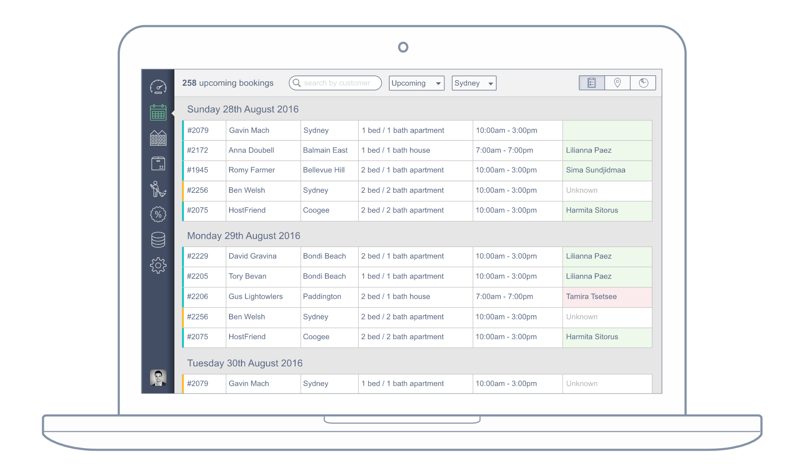
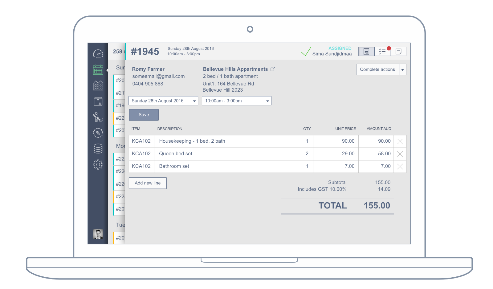
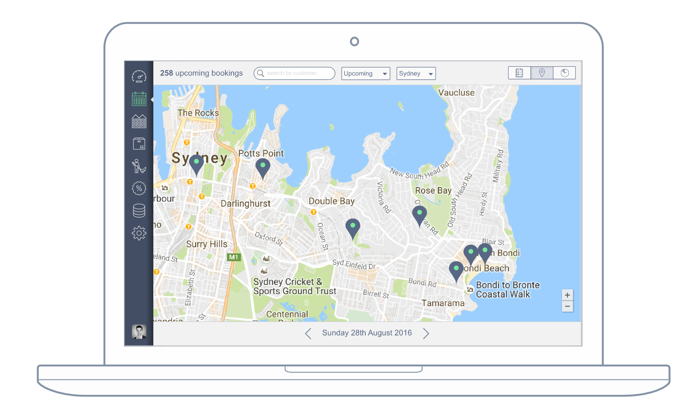

# Roger Chapman
## Award winning Software Engineer, Creative Technologist and UX Designer

### Hometime On Demand native app

| What?            | Description                        |
| ---              | ---                                | 
| **Discipline**   | UX, Design, Code, DevOps           |
| **Language**     | Go, JavaScript, Objective-C, Java  | 
| **Technology**   | AWS, MongoDB, GraphQL, React Native, Redux, iOS, Android  |
| **Integration**  | Intercom, Mailjet |

### Hometime Control

| What?            | Description                        |
| ---              | ---                                | 
| **Discipline**   | UX, Design, Code, DevOps           |
| **Language**     | Go, JavaScript, HTML5, CSS3        | 
| **Technology**   | AWS, MongoDB, GraphQL, React, Redux, Webpack |
| **Integration**  | Intercom, Mailjet, Google Calendar, Xero |

