# Roger Chapman
## Award winning Software Engineer, Creative Technologist and UX Designer

Roger Chapman has over 12 years experience in Software Engineering;
he is passionate about the web and native mobile apps.
With strong communication, UX, and design skills, Roger has a unique set of skills as an Engineer.

Roger has worked on large scale applications for clients in Australia & the UK:
including Google, Commonwealth Bank, Optus, Lexus, IAG, AusTrade, Freedom Furniture, Disney, Mars, Trinity Mirror, Royal Bank of Scotland and The Scottish Government.

### Hometime On Demand native app

| What?            | Description                        |
| ---              | ---                                | 
| **Discipline**   | UX, Design, Code, DevOps           |
| **Language**     | Go, JavaScript, Objective-C, Java  | 
| **Technology**   | AWS, MongoDB, GraphQL, React Native, Redux, iOS, Android  |
| **Integration**  | Intercom, Mailjet |

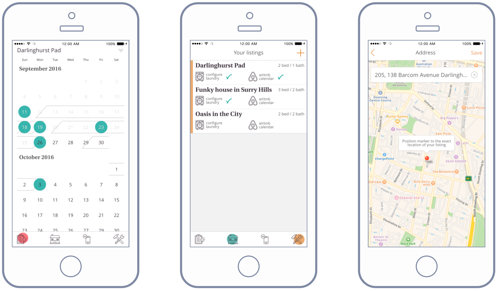

### Hometime Control

| What?            | Description                        |
| ---              | ---                                | 
| **Discipline**   | UX, Design, Code, DevOps           |
| **Language**     | Go, JavaScript, HTML5, CSS3        | 
| **Technology**   | AWS, MongoDB, GraphQL, React, Redux, Webpack |
| **Integration**  | Intercom, Mailjet, Google Calendar, Xero |

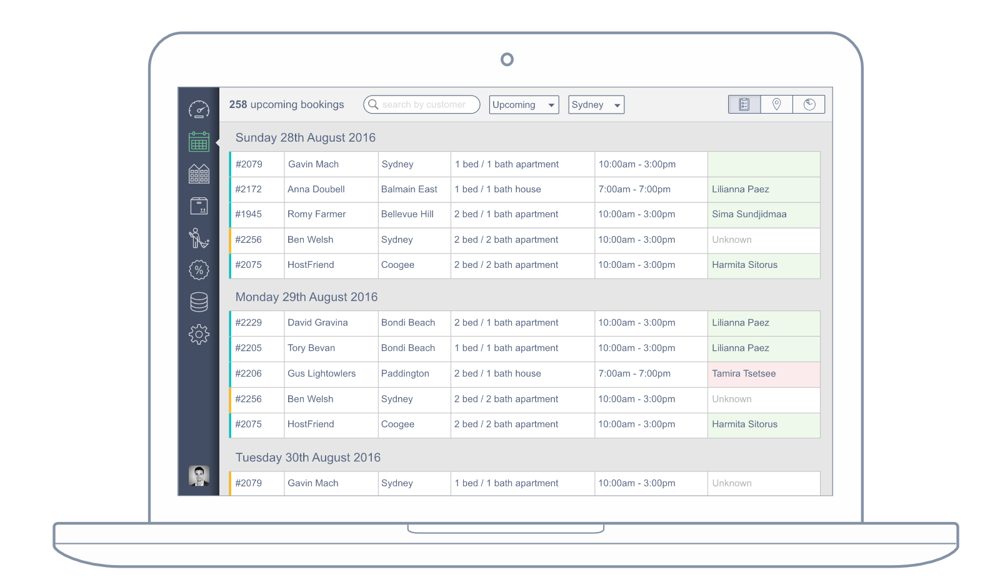

### Hometime Client native app

| What?            | Description                        |
| ---              | ---                                | 
| **Discipline**   | UX, Design, Code, DevOps           |
| **Language**     | JavaScript, Objective-C            | 
| **Technology**   | Google Firebase, React Native, Redux, iOS  |
| **Integration**  | Intercom |

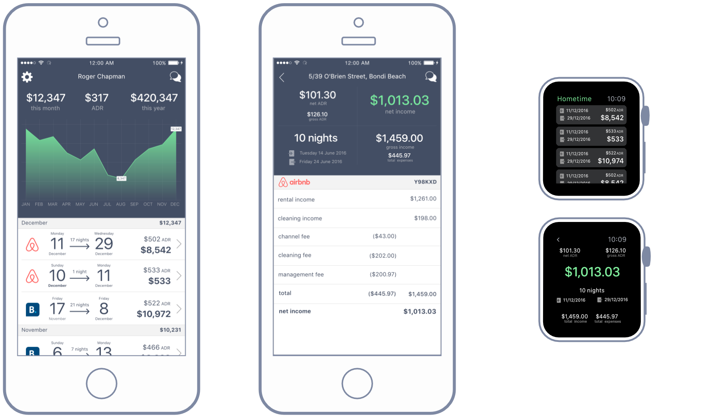

### Kayla Control

| What?            | Description                        |
| ---              | ---                                | 
| **Discipline**   | UX, Design, Code, DevOps           |
| **Language**     | JavaScript, HTML5, CSS3            | 
| **Technology**   | AWS, MongoDB, NodeJS, Meteor, React |
| **Integration**  | Intercom, Mandrill, Google Calendar, Xero, Tookan |

### Kayla Host application

| What?            | Description                        |
| ---              | ---                                | 
| **Discipline**   | UX, Design, Code, DevOps           |
| **Language**     | JavaScript, HTML5, CSS3            | 
| **Technology**   | AWS, MongoDB, NodeJS, Meteor, React |
| **Integration**  | Intercom, Mandrill |

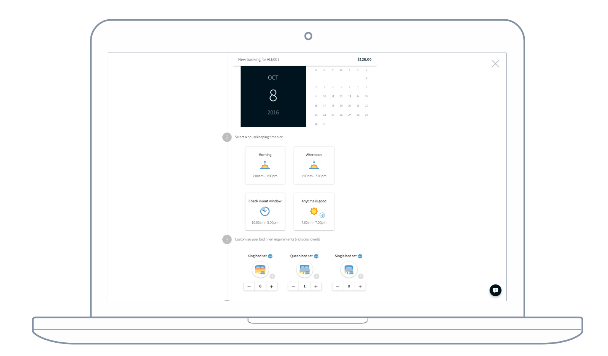

### Kayla Marketing site

| What?            | Description                        |
| ---              | ---                                | 
| **Discipline**   | Code, DevOps, Photography          |
| **Language**     | JavaScript, HTML5, CSS3, SVG       | 
| **Technology**   | AWS S3, React |
| **Integration**  | Intercom |

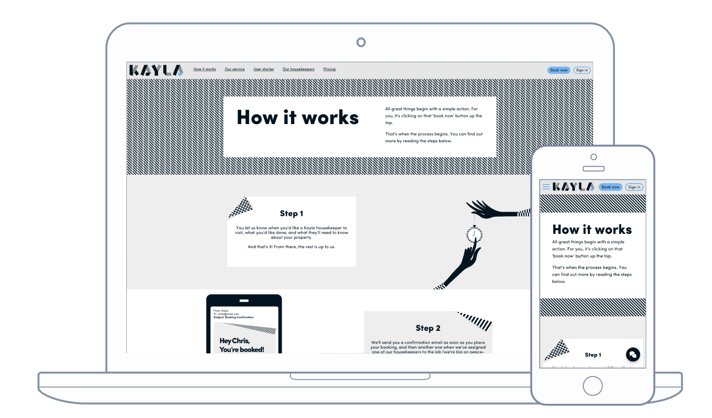
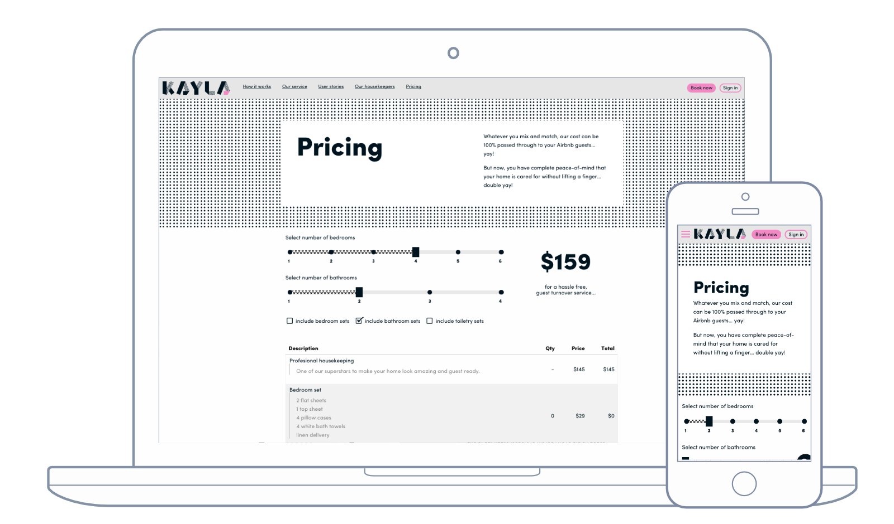

### Kayla Blog site

| What?            | Description                    |
| ---              | ---                            | 
| **Discipline**   | DevOps, Code (Frontend)        |
| **Language**     | HTML5, CSS3                    | 
| **Technology**   | AWS, Docker,  Ghost Blogging   |

### Phonapi native app

| What?            | Description                        |
| ---              | ---                                | 
| **Discipline**   | UX, Code, DevOps                   |
| **Language**     | JavaScript, Objective-C            | 
| **Technology**   | AWS, React Native, GraphQL, NodeJS, iOS |
| **Integration**  | Twilio                             |

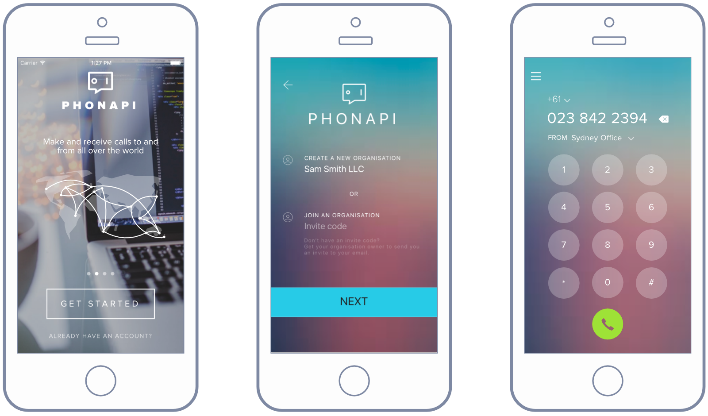

### ACRF - The One interactive site

| What?            | Description                        |
| ---              | ---                                | 
| **Discipline**   | UX, Code, DevOps                   |
| **Language**     | JavaScript, HTML5, CSS3            | 
| **Technology**   | AWS, NodeJS, WebGL, WebRTC, WebAudioAPI  |
| **Awards**       | W3, FWA, CLIO                            |

### CBA - Wallet Run console game

| What?            | Description            |
| ---              | ---                    | 
| **Discipline**   | Code, Game Design      |
| **Language**     | C#                     | 
| **Technology**   | Unity 3D, Microsoft Kinect       |

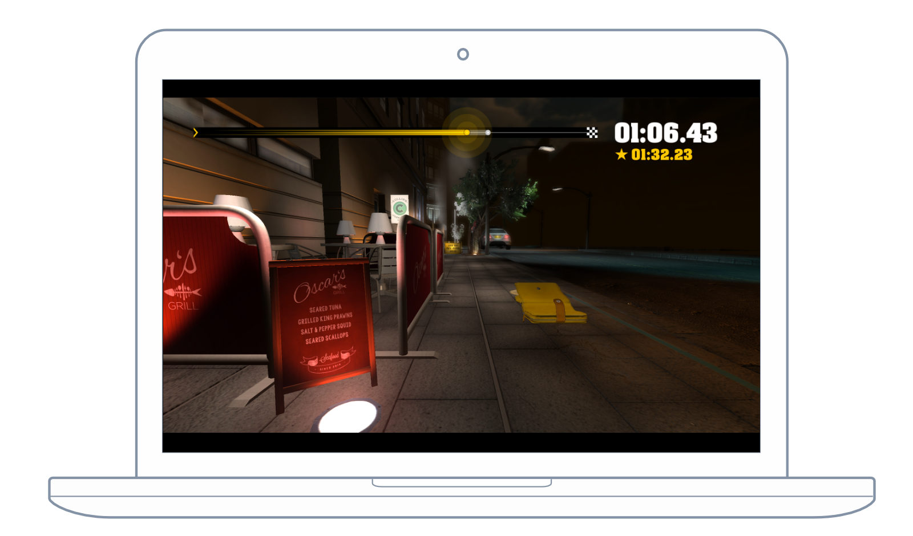
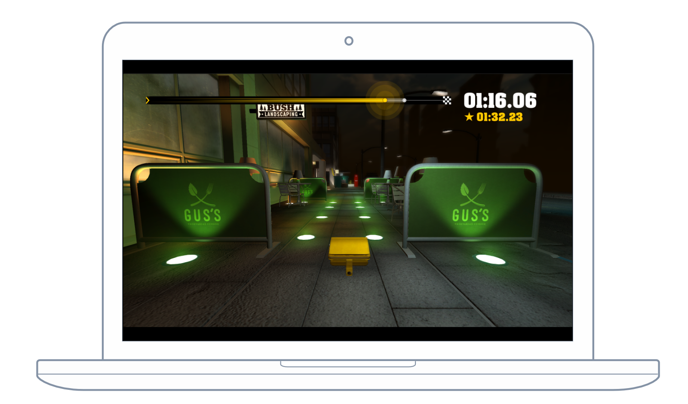
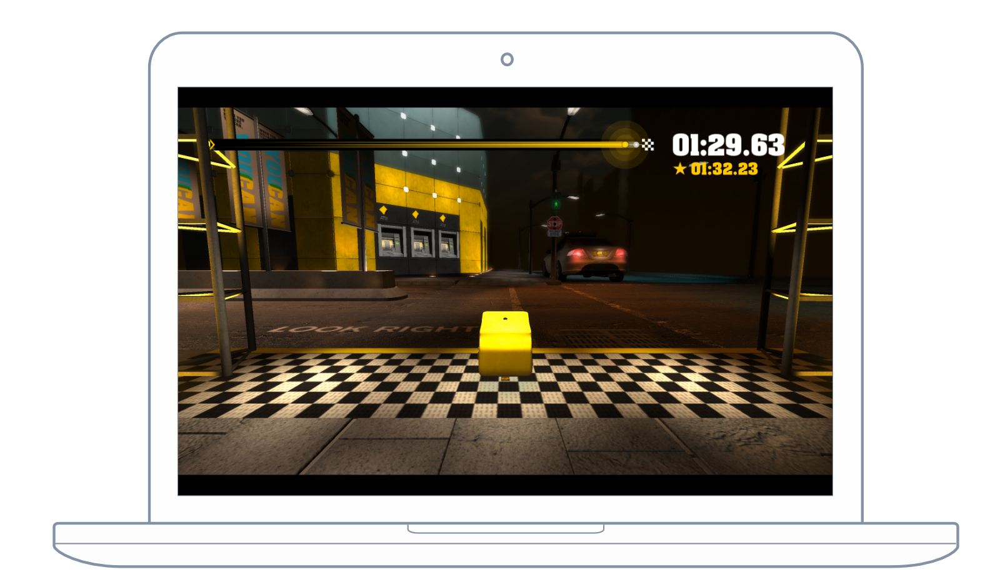

### Freedom Furniture iOS app

| What?            | Description              |
| ---              | ---                      | 
| **Discipline**   | Code                     |
| **Language**     | Objective-C              | 
| **Technology**   | iOS, iPhone & iPad       |

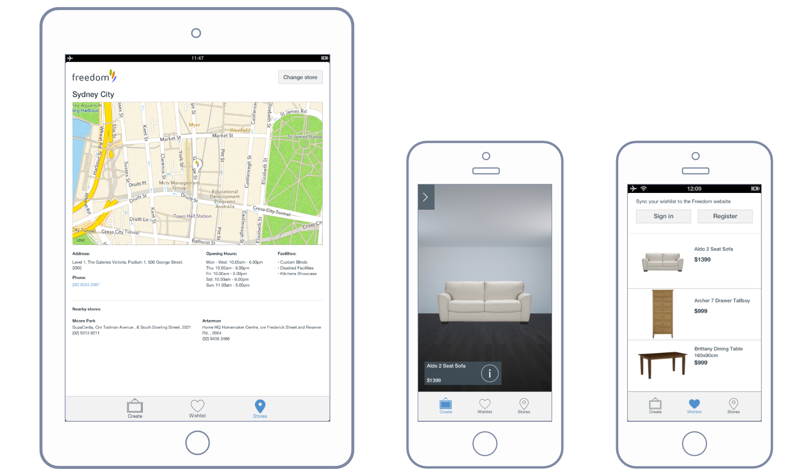

### Optus - Shark detection buoy (Clever Buoy)

| What?            | Description              |
| ---              | ---                      | 
| **Discipline**   | Consultancy, Code (Database Server) |
| **Language**     | JavaScript              | 
| **Technology**   | NodeJS, TCP, Satellite, Sonar  |
| **Awards**   | 8 Cannes Lion's, SXSW Innovation, 5 D&AD Pencil, One Show |

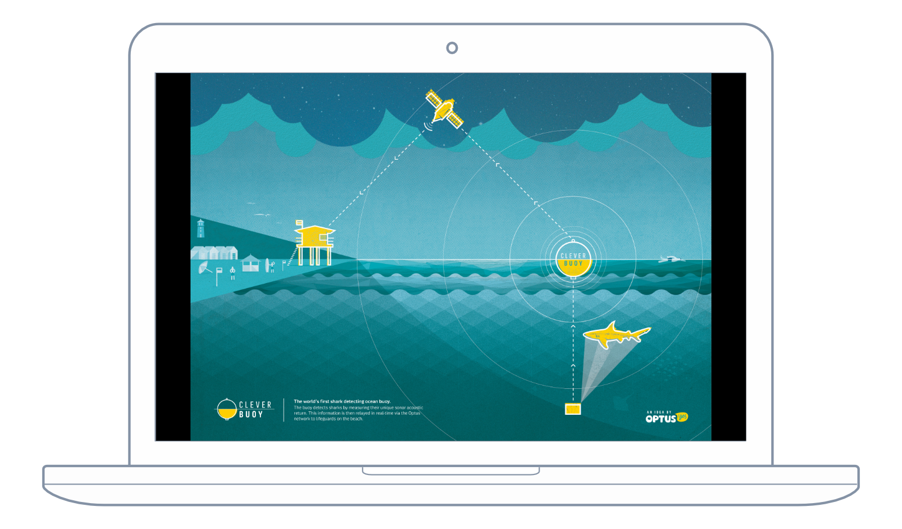
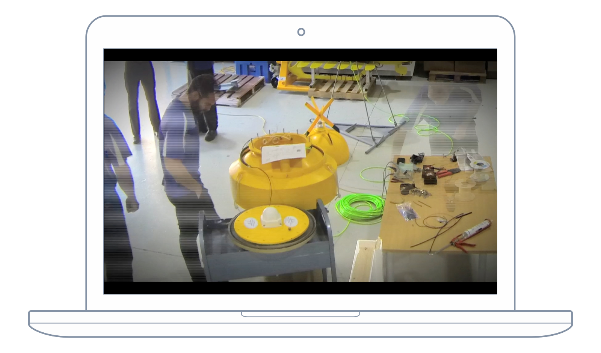
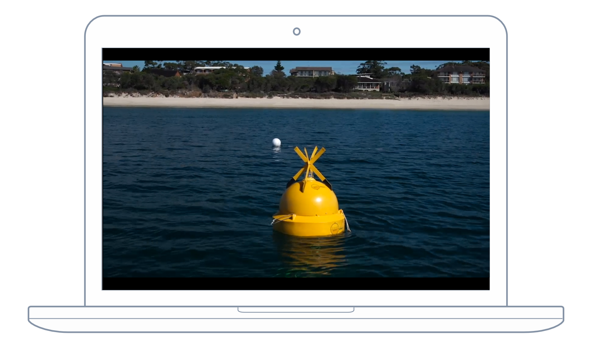

### Lexus - Reactive Heart-Beat car/paint

| What?            | Description              |
| ---              | ---                      | 
| **Discipline**   | Consultancy, Electronics |
| **Language**     | C++                      | 
| **Technology**   | Arduino                  |

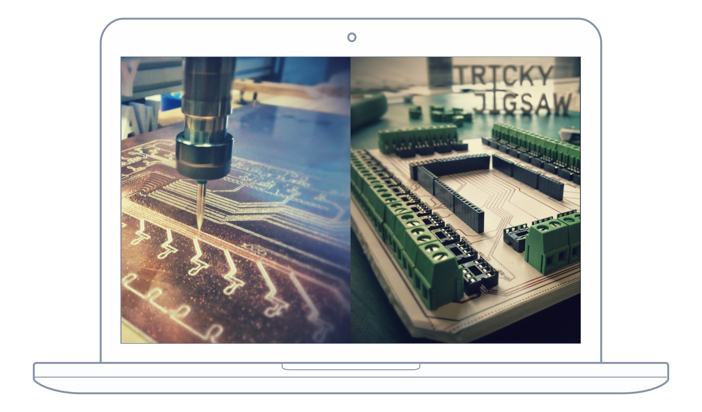
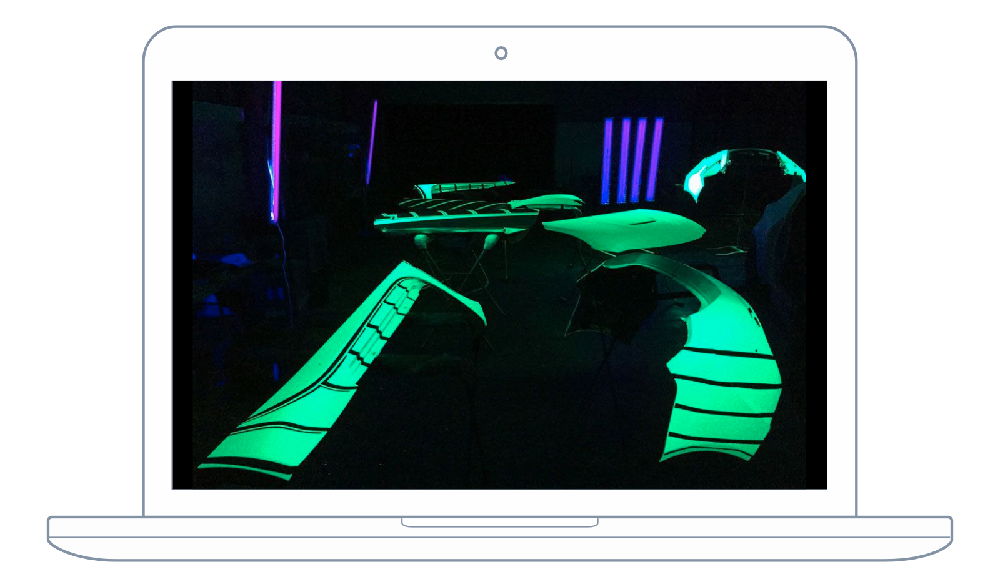

### CBA - Where's My Wallet online Gigapixel "tressure hunt" game

| What?            | Description              |
| ---              | ---                      | 
| **Discipline**   | Code, DevOps               |
| **Language**     | JavaScript, HTML5, CSS3                     | 
| **Technology**   | AWS, NodeJS, WebGL         |
| **Awards**       | FWA, IAB      |

### AusTrade - E-reader native app/platform

| What?            | Description              |
| ---              | ---                      | 
| **Discipline**   | Code               |
| **Language**     | Objective-C, Java, JavaScript                     | 
| **Technology**   | iOS, Android, NodeJS         |

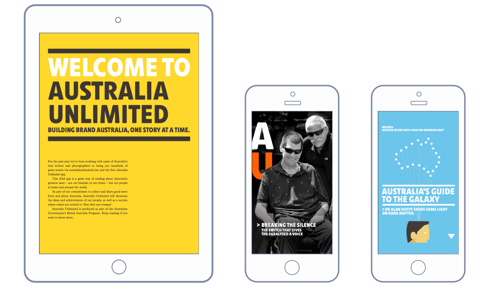

### Noiseboard - Interactive site

| What?            | Description              |
| ---              | ---                      | 
| **Discipline**   | Code, UX                 |
| **Language**     | JavaScript               | 
| **Technology**   | WebAudioAPI, WebRTC, HTML5 Canvas      |
| **Awards**       | FWA, Webby, ADMA, A Award, Cannes Lion, LIA, Kinsale Sharks     |

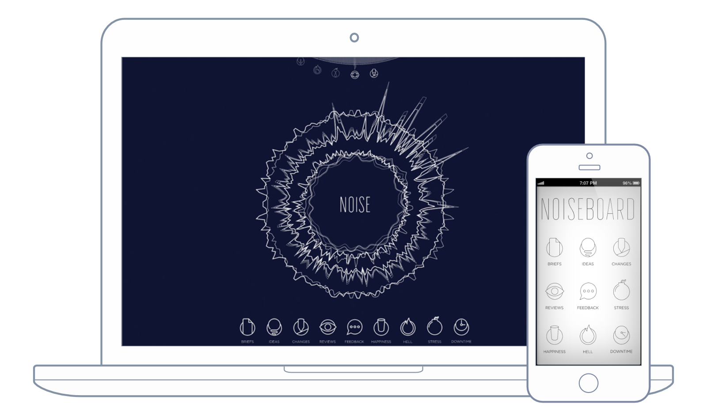

### Google - Movember Games: WebRTC controlled games

| What?            | Description              |
| ---              | ---                      | 
| **Discipline**   | Code, UX                 |
| **Language**     | JavaScript               | 
| **Technology**   | WebRTC, Box2D            |
| **Awards**       | FWA                      |

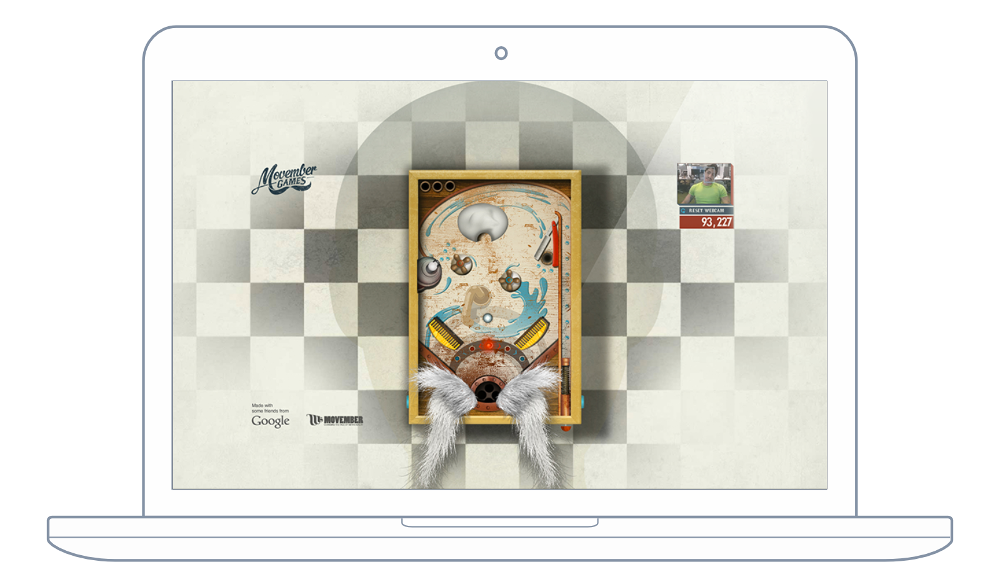
