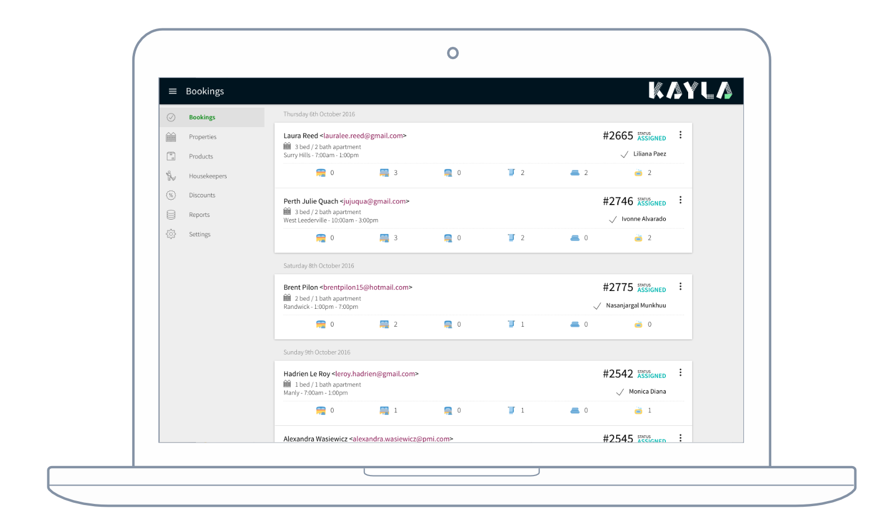

# Roger Chapman
## Award winning Software Engineer, Creative Technologist and UX Designer

Roger Chapman has over 12 years experience in Software Engineering;
he is passionate about the web and native mobile apps.
With strong communication, UX, and design skills, Roger has a unique set of skills as an Engineer.

Roger has worked on large scale applications for clients in Australia & the UK:
including Google, Commonwealth Bank, Optus, Lexus, IAG, AusTrade, Freedom Furniture, Disney, Mars, Trinity Mirror, Royal Bank of Scotland and The Scottish Government.

### Hometime On Demand native app

| What?            | Description                        |
| ---              | ---                                | 
| **Discipline**   | UX, Design, Code, DevOps           |
| **Language**     | Go, JavaScript, Objective-C, Java  | 
| **Technology**   | AWS, MongoDB, GraphQL, React Native, Redux, iOS, Android  |
| **Integration**  | Intercom, Mailjet |

### Hometime Control

| What?            | Description                        |
| ---              | ---                                | 
| **Discipline**   | UX, Design, Code, DevOps           |
| **Language**     | Go, JavaScript, HTML5, CSS3        | 
| **Technology**   | AWS, MongoDB, GraphQL, React, Redux, Webpack |
| **Integration**  | Intercom, Mailjet, Google Calendar, Xero |

### Hometime Client native app

| What?            | Description                        |
| ---              | ---                                | 
| **Discipline**   | UX, Design, Code, DevOps           |
| **Language**     | JavaScript, Objective-C            | 
| **Technology**   | Google Firebase, React Native, Redux, iOS  |
| **Integration**  | Intercom |

### Kayla Control

| What?            | Description                        |
| ---              | ---                                | 
| **Discipline**   | UX, Design, Code, DevOps           |
| **Language**     | JavaScript, HTML5, CSS3            | 
| **Technology**   | AWS, MongoDB, NodeJS, Meteor, React |
| **Integration**  | Intercom, Mandrill, Google Calendar, Xero, Tookan |

### Kayla Host application

| What?            | Description                        |
| ---              | ---                                | 
| **Discipline**   | UX, Design, Code, DevOps           |
| **Language**     | JavaScript, HTML5, CSS3            | 
| **Technology**   | AWS, MongoDB, NodeJS, Meteor, React |
| **Integration**  | Intercom, Mandrill |

